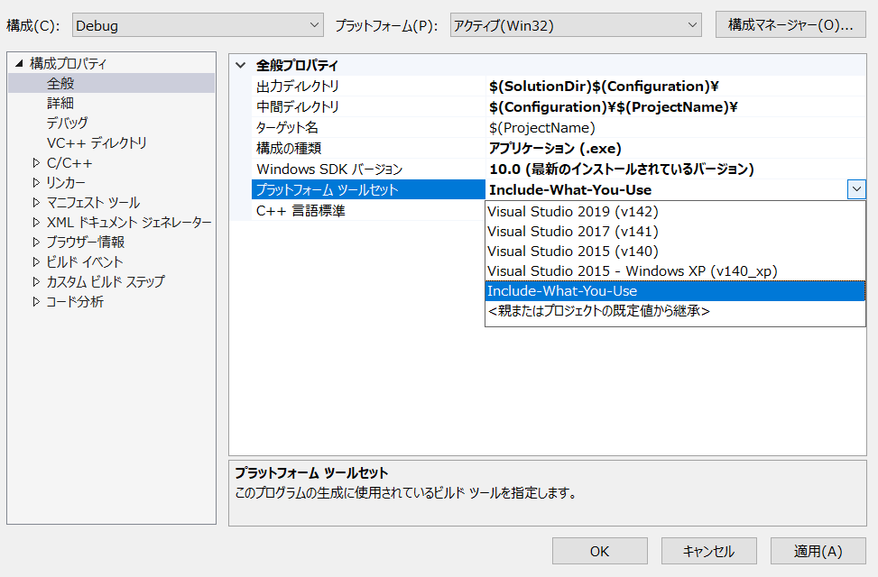
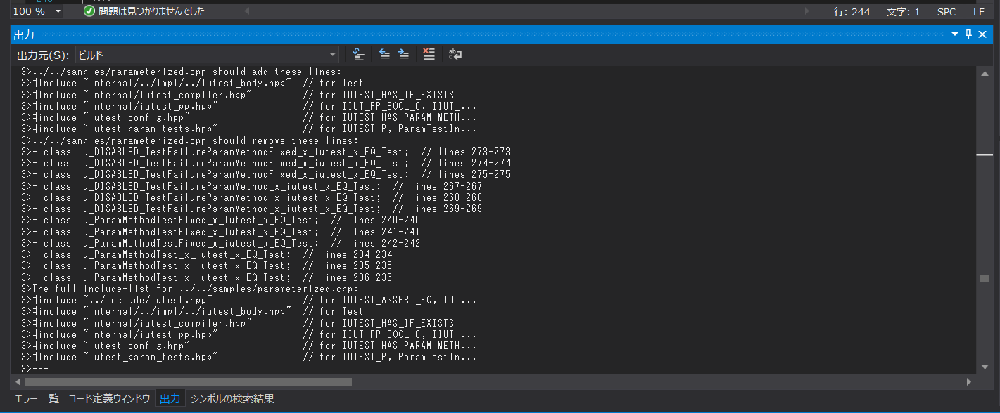

Include-What-You-Use-CL
===

Include-What-You-Use-CL is Visual Studio toolset for Include-What-You-Use

## Dependency

[Include-What-You-Use](http://include-what-you-use.org/)  

## Install

```
git clone https://github.com/srz-zumix/include-what-you-use-cl.git
cd include-what-you-use-cl
install.bat
```

## Usage

1. Project Settings > Platform toolset  
Select "Include-What-You-Use"

1. Compile
1. Get Include-What-You-Use result  


## Uninstall

```
uninstall.bat
```
